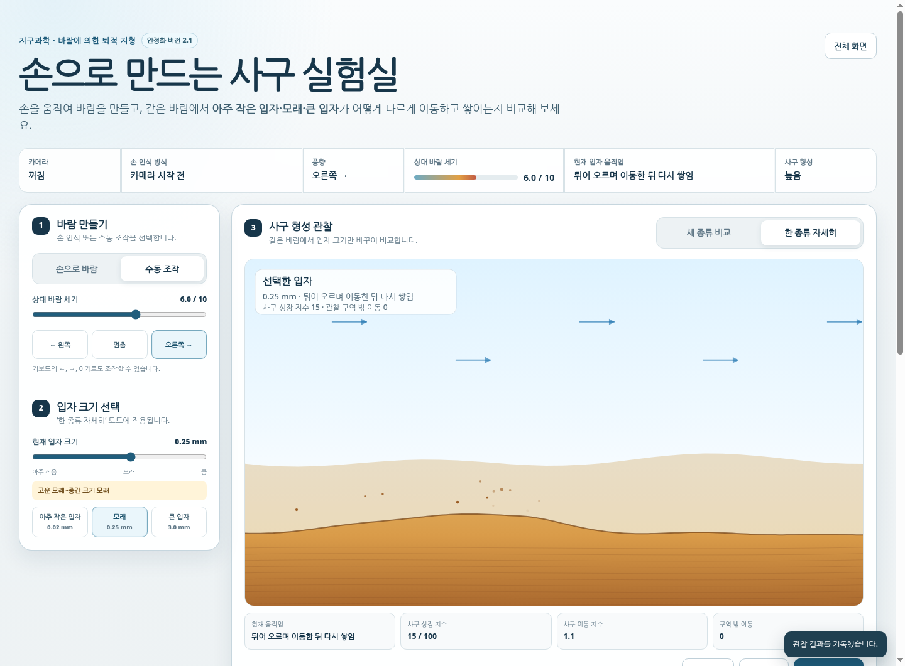

# 손으로 만드는 사구 실험실

MediaPipe Hand Landmarker와 카메라 영상의 가로 움직임 감지를 활용하여, 같은 바람에서 입자 크기에 따라 이동·퇴적·사구 형성이 어떻게 달라지는지 비교하는 지구과학 수업용 반응형 웹앱입니다.

- 안정화 버전: **2.1.0**
- 배포 방식: 정적 HTML·CSS·JavaScript / GitHub Pages
- 화면 언어: 한국어
- 서버·API 키·로그인: 필요 없음



<p align="center"></p>

## 이번 안정화 버전에서 바뀐 점

이전 버전은 카메라를 열기 전에 외부 CDN의 MediaPipe 파일을 기다렸습니다. 학교망이나 브라우저에서 CDN 연결이 막히면 화면이 계속 `손 인식 모형을 불러오는 중…`에 머물고, 카메라 요청까지 실행되지 않는 문제가 있었습니다.

버전 2.1은 다음 순서로 동작합니다.

1. 사용자가 `카메라 시작`을 누르면 브라우저 카메라를 먼저 연결합니다.
2. 카메라 영상의 좌우 움직임을 이용한 대체 인식이 즉시 시작됩니다.
3. MediaPipe Hand Landmarker는 백그라운드에서 별도로 준비됩니다.
4. MediaPipe가 준비되면 자동으로 손 관절 인식 방식으로 전환됩니다.
5. CDN·모델 연결이 실패하거나 시간이 초과되어도 카메라 움직임 감지와 수동 조작은 계속 작동합니다.

또한 숨겨진 캔버스의 크기를 0×0 상태에서 잘못 계산하던 구조를 수정하여, 관찰 모드를 전환한 뒤 보이는 캔버스만 실제 크기로 다시 계산합니다.

## 수업의 핵심 질문

> 왜 사구는 아주 작은 입자나 큰 입자보다 모래 크기의 입자에서 잘 형성될까?

웹앱은 다음 세 조건을 같은 바람에서 비교합니다.

| 비교 조건 | 기본 입자 크기 | 웹앱에서 관찰되는 핵심 현상 |
|---|---:|---|
| 아주 작은 입자 | 0.02 mm | 약한 바람에는 응집력 때문에 표면에 남고, 충분히 강한 바람에는 공중에 떠 멀리 빠져나감 |
| 사구를 잘 이루는 모래 | 0.25 mm | 지표 가까이에서 튀어 이동한 뒤 다시 쌓여 사구가 성장함 |
| 큰 입자 | 3.0 mm | 무게가 커 같은 바람에서 거의 움직이지 않음 |

학생 화면에서는 `부유·도약·포행`을 주요 조작 용어로 쓰지 않고 다음과 같이 현상 중심으로 표시합니다.

- 공중에 떠서 멀리 이동
- 튀어 오르며 이동한 뒤 다시 쌓임
- 지표면을 따라 구르거나 미끄러짐
- 무거워서 거의 움직이지 않음

## 주요 기능

### 카메라 조작

- MediaPipe Hand Landmarker가 사용 가능할 때: 손바닥과 21개 손 관절점을 추적하여 손의 가로 이동 속도·방향을 바람으로 변환
- MediaPipe 연결 실패 시: 카메라 프레임의 가로 움직임을 분석하여 자동으로 대체 작동
- 카메라 권한 거부·장치 없음·다른 앱의 카메라 점유 등 오류를 한국어로 안내
- `MediaPipe 다시 연결` 버튼 제공
- 카메라 영상과 좌표는 서버로 전송하거나 저장하지 않음

### 수동 조작

- 상대 바람 세기 0~10
- 왼쪽 바람·멈춤·오른쪽 바람
- 키보드 `←`, `→`, `0`
- 카메라를 사용할 수 없는 교실에서도 전체 수업 진행 가능

### 시뮬레이션

- 세 종류 입자 동시 비교
- 한 종류 자세히 관찰
- 입자 크기 0.005~5 mm 로그 슬라이더
- 바람 방향·입자 이동·사구 성장·관찰 구역 밖 이동 시각화
- 바람받이 사면·사구 마루·바람그늘 사면 표시
- 입자 크기별 이동 시작 기준의 U자형 개념 그래프
- 일시 정지·초기화

### 수업 기록

- 현재 입자 크기, 바람 세기·방향, 이동 상태, 사구 형성 가능성, 성장 지수 기록
- 브라우저 `localStorage`에 최대 60개 기록 저장
- 한글 CSV 저장

## 프로젝트 구조

```text
sand-dune-hand-lab-v2/
├── index.html
├── styles.css
├── favicon.svg
├── .nojekyll
├── README.md
├── PRD.md
├── TEST_REPORT.md
├── DEPLOY_CHECKLIST.md
├── LICENSE
├── package.json
├── docs/
│   ├── preview-desktop.png
│   └── preview-mobile.png
├── js/
│   ├── app.js
│   ├── camera-controller.js
│   ├── motion-analyzer.js
│   ├── dune-simulation.js
│   └── science-model.js
└── tests/
    └── run-tests.mjs
```

## GitHub Pages 배포

1. 이 프로젝트 ZIP의 압축을 풉니다.
2. GitHub 저장소에 **폴더 자체가 아니라 폴더 안의 파일 전체**를 올립니다.
3. 저장소 첫 화면에서 `index.html`, `styles.css`, `js` 폴더가 바로 보여야 합니다.
4. GitHub 저장소에서 `Settings → Pages`로 이동합니다.
5. `Source`를 `Deploy from a branch`로 선택합니다.
6. 브랜치를 `main`, 폴더를 `/(root)`로 선택하고 저장합니다.
7. 배포가 끝난 뒤 표시되는 `https://사용자명.github.io/저장소명/` 주소로 접속합니다.
8. `카메라 시작`을 누르고 주소창의 카메라 권한을 허용합니다.

중요: `index.html`을 컴퓨터에서 더블클릭해 연 `file://` 화면으로 최종 테스트하지 마세요. 카메라는 GitHub Pages의 HTTPS 주소 또는 개발용 `localhost`에서 확인해야 합니다.

## 로컬 실행

Python이 설치된 경우 프로젝트 폴더에서 다음 명령을 실행합니다.

```bash
python3 -m http.server 8000
```

브라우저에서 다음 주소로 접속합니다.

```text
http://localhost:8000
```

Node.js가 설치되어 있으면 정적 검사와 핵심 함수 테스트를 실행할 수 있습니다.

```bash
npm run check
npm test
```

## 주소 옵션

- `?offline=1`: MediaPipe 연결을 시도하지 않고 카메라 움직임 감지만 사용
- `?engine=motion`: 위와 동일
- `?test=1`: 개발용으로 MediaPipe 연결 제한 시간을 짧게 설정

예시:

```text
https://사용자명.github.io/저장소명/?offline=1
```

학교망에서 MediaPipe CDN이 차단되는 경우에도 이 주소로 카메라 움직임 감지 모드를 고정할 수 있습니다.

## 카메라 문제 해결

### 카메라 영상 자체가 나오지 않는 경우

1. GitHub Pages의 `https://` 주소인지 확인합니다.
2. 주소창 왼쪽의 사이트 설정에서 카메라를 `허용`으로 바꿉니다.
3. Zoom, Google Meet, Teams, 기본 카메라 앱처럼 카메라를 사용 중인 프로그램을 닫습니다.
4. 브라우저를 새로고침하고 다시 시작합니다.
5. Chrome 또는 Edge의 최신 버전에서 다시 확인합니다.
6. 그래도 되지 않으면 `수동 조작`으로 수업을 진행합니다.

### 카메라는 나오지만 손 관절선이 보이지 않는 경우

화면 상단의 `손 인식 방식`을 확인합니다.

- `MediaPipe 손 인식`: 손 관절 인식이 정상 작동 중입니다.
- `MediaPipe 준비 중`: 외부 파일을 불러오는 중입니다.
- `움직임 감지(대체)`: MediaPipe 연결이 되지 않았지만 카메라 움직임으로 바람을 만들 수 있습니다.

`움직임 감지(대체)`에서는 손뿐 아니라 배경의 큰 움직임도 감지될 수 있으므로, 카메라를 고정하고 손만 좌우로 움직이는 것이 좋습니다.

### 화면이 이전 버전으로 보이는 경우

GitHub Pages와 브라우저 캐시 때문에 이전 파일이 잠시 남을 수 있습니다.

1. GitHub 저장소에서 파일 업로드가 완료되었는지 확인합니다.
2. `Actions` 또는 `Settings → Pages`에서 배포가 끝났는지 확인합니다.
3. 브라우저에서 강력 새로고침을 합니다.
   - Windows: `Ctrl + Shift + R`
   - macOS: `Command + Shift + R`
4. 주소 끝에 임시로 `?v=21`을 붙여 접속합니다.

## 과학 모형의 범위

이 앱은 실제 풍동의 절대 풍속을 계산하지 않고, `0~10`의 상대 바람 세기를 사용하는 규칙 기반 개념 모형입니다. 아주 작은 입자 쪽에서는 응집력, 큰 입자 쪽에서는 무게 때문에 이동 시작에 더 강한 바람이 필요한 U자형 경향을 단순화했습니다.

실제 사구의 형성에는 입자 크기 외에도 수분, 식생, 모래 공급량, 지표 상태, 바람의 지속 시간과 방향 변화가 함께 작용합니다. 따라서 학생에게는 다음과 같이 정리하는 것이 적절합니다.

> 입자가 너무 크거나 너무 작으면 사구가 절대로 형성되지 않는 것이 아니라, 같은 바람 조건에서 모래 크기의 입자보다 사구를 형성하기 어렵다.

## 라이선스

프로젝트 코드는 MIT License를 따릅니다. MediaPipe 관련 라이브러리와 모델은 각 제공처의 라이선스와 이용 조건을 따릅니다.
